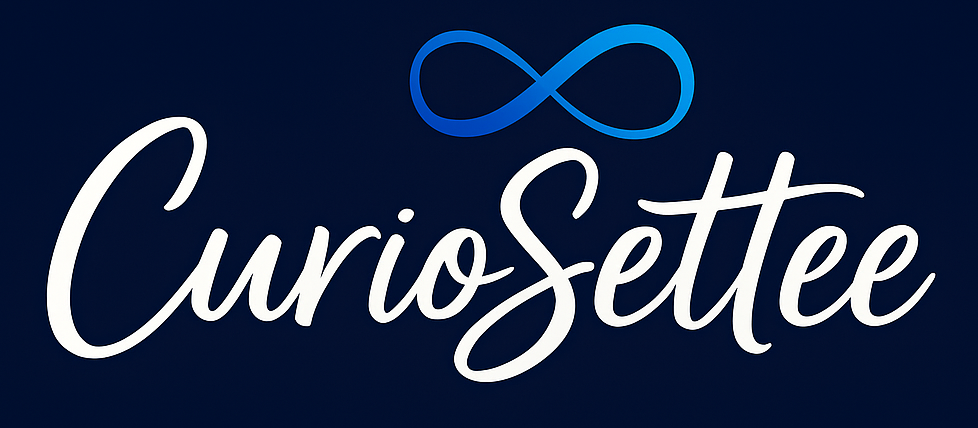

#   
**Curiosettee**  
*Where Curiosity Fuels Code, Stories & Systems*  

  
  
  
  
  

---

## 🌟 About Curiosettee
Curiosettee is the digital lounge of H where she shares, builds, and learns in public. This is a flotsam and jetsam of the following things:
- **Tech Tutorials & Builds**: hands-on guides, code snippets, DevOps pipelines, web frameworks.
- **Fieldnotes & Footnotes**: personal reflections, travel stories, day-to-day insights.
- **CurioMind**: mindset tools, mindfulness for devs, NLP, human design & astrology–inspired productivity.
- **Digital Strategy & Knowledge Work**: documentation frameworks, FinOps, knowledge management, cloud governance.
- **Soul + Systems**: bridging spiritual frameworks with structured workflows to optimize creativity and career.
- **CurioSyntax**: technical writing best practices, Docs-as-Code, markdown patterns, API docs samples.
- **Project Echoes & Experiments**: prototypes, GPT prompts, mini-projects, design experiments, creative coding.
- **CurioSignals (Tech Roundups)**: curated monthly digests of cloud, AI, DevOps, productivity tools, and more.

---

## 📂 Repositories in Progress

Below are some of our key repositories. Each repo focuses on one or more Curiosettee categories. Inside each repo, you’ll typically find a `README.md` explaining the goals, setup, technologies used, and how to contribute.

- **🔧 Tech Tutorials & Builds**  
  - `devops-demos/`: sample GitHub Actions, pipelines, containerization demos.  
  - `static-site-integrations/`: examples of Hugo + Streamlit, Ghost, Django and other deployment scripts.  

- **📝 Documentation & CurioSyntax**  
  - `docs-as-code-samples/`: API docs templates, MkDocs/Docusaurus demos, versioned SOP examples in Git.  
  - `technical-writing-guides/`: markdown style guides, writing checklists, readability tools, SEO-friendly docs examples.

- **🌍 Fieldnotes & Reflections**  
  - `personal-fieldnotes/`: anonymized journal snippets, travel sketches, lessons learned in projects (structured as markdown).  
  - `career-retrospectives/`: LIP logs, 30-minute daily steps archives, transition plans, productivity experiments.

- **🌿 CurioMind (Soft Skills & Growth Tools)**  
  - `mindset-templates/`: mindfulness exercises for devs, NLP anchors, energy-mapping templates, journaling prompts.  
  - `human-design-astro/`: nerding into energetics and how technology can aid in self-discovery by way of modalities like human design, birth charts, etc. 

- **🔍 CurioSignals (Tech Roundups)**  
  - `tech-roundups/`: fetch news via APIs, newsletter integration, deep dives on tech rabbitholes that merit investigation or exploration

- **💡 Project Echoes & Experiments**  
  - `mini-projects-lab/`: random prototypes 
  - `community-challenges/`: we might eventually open some repos for community consumption based on learnings from the LIP and Ship Community. 

---

## 🚀 Getting Started

Actively under progress so I'll teach you the deets in the next commits!!! <3 
